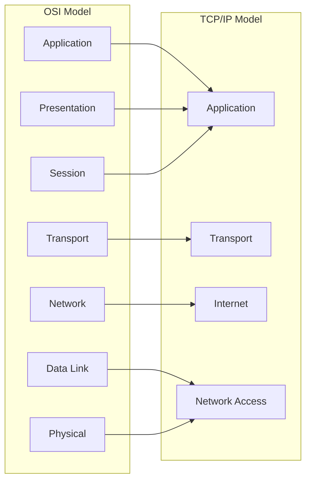
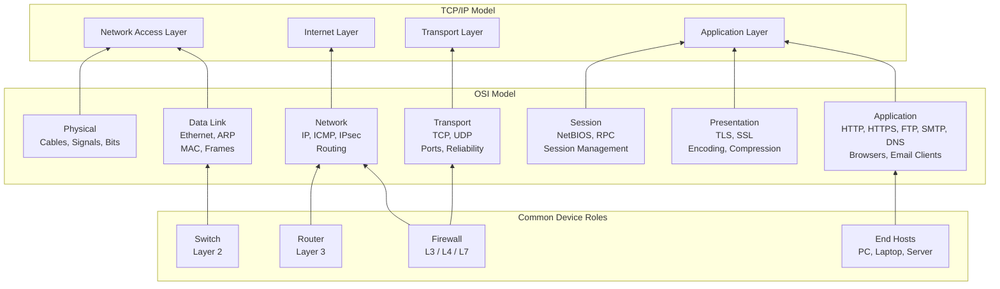
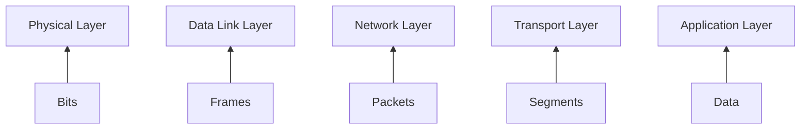
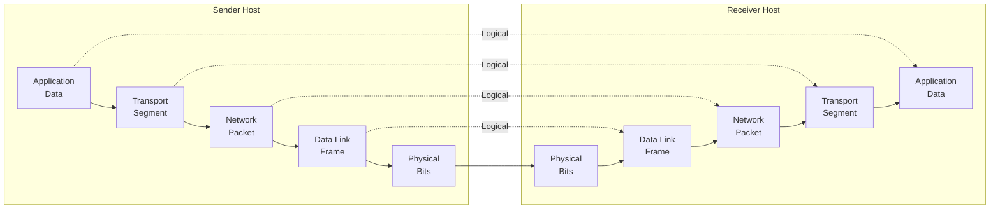
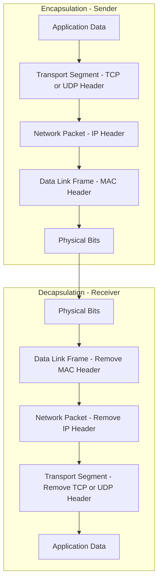

# TCP/IP Model

This section explains the TCP/IP model as used by operating systems.

Focus areas:
- Application layer and services
- Transport layer responsibilities
- Network layer addressing and routing
- Link layer and local delivery

# TCP/IP Model

## 1. What problem do networking models solve?
Networking models exist to structure thinking about complex communication systems.
They provide a shared language that allows engineers to design, implement,
and troubleshoot networks without guessing or reinventing concepts.

## 2. Why multiple models exist
Different models exist because they serve different purposes:

- **OSI Model** focuses on learning, abstraction, and troubleshooting.
  It helps engineers reason about problems by separating concerns.
- **TCP/IP Model** reflects how operating systems and networks actually
  implement communication in real-world systems.

These models are complementary, not competing.

## 3. OSI vs TCP/IP mapping

## 4. How engineers actually use models
Engineers use networking models as mental frameworks:

- During troubleshooting, to isolate problems layer by layer.
- During communication, to describe issues clearly with other engineers.
- During system design, to separate responsibilities and avoid tight coupling.

## 5. Why this matters in real work
Understanding networking models reduces random trial-and-error debugging.
It allows engineers to approach problems systematically, communicate efficiently,
and design systems that scale and remain maintainable.

> Layers are shown bottom-up to reflect how data is physically transmitted
> before being encapsulated and processed at higher levels.

## OSI Layers Explained (Bottom → Top)

### 1. Physical Layer (Layer 1)
**Purpose:**  
Transfers raw bits over a physical medium.

**What actually happens:**  
Electrical, optical, or radio signals represent binary data (0s and 1s).  
This layer does not understand frames, IP addresses, or ports.

**Examples:**  
- Ethernet cables  
- Fiber optics  
- Wi-Fi radio signals  

**Devices:**  
- Cables  
- Network Interface Cards (physical interface)  
- Repeaters  

**Typical issues:**  
- Disconnected or damaged cable  
- No link light  
- Hardware failure  

**Troubleshooting question:**  
> Is there a physical signal?

---

### 2. Data Link Layer (Layer 2)
**Purpose:**  
Delivers data within the same local network.

**What actually happens:**  
Bits are grouped into frames and delivered using MAC addresses.

**Protocols:**  
- Ethernet  
- ARP  
- Wi-Fi (802.11)

**Devices:**  
- Switches  
- Network Interface Cards  

**Typical issues:**  
- ARP failures  
- MAC address conflicts  
- Switch misconfiguration  

**Troubleshooting question:**  
> Can devices see each other on the local network?

---

### 3. Network Layer (Layer 3)
**Purpose:**  
Routes data between different networks.

**What actually happens:**  
Logical addressing (IP) and routing decisions determine the path packets take.

**Protocols:**  
- IP  
- ICMP  
- IPsec  

**Devices:**  
- Routers  
- Firewalls (packet filtering)  

**Typical issues:**  
- Incorrect IP address  
- Wrong default gateway  
- Routing problems  

**Troubleshooting question:**  
> Can I reach the destination network?

---

### 4. Transport Layer (Layer 4)
**Purpose:**  
Provides end-to-end communication between applications.

**What actually happens:**  
Manages ports, reliability, ordering, and flow control.

**Protocols:**  
- TCP (reliable, connection-oriented)  
- UDP (fast, connectionless)

**Examples:**  
- TCP 80 / 443 (HTTP / HTTPS)  
- UDP 53 (DNS)

**Typical issues:**  
- Blocked ports  
- Firewall rules  
- Connection timeouts  

**Troubleshooting question:**  
> Is the service reachable on the correct port?

---

### 5. Session Layer (Layer 5)
**Purpose:**  
Manages sessions between communicating systems.

**What actually happens:**  
Establishes, maintains, and terminates logical sessions.

**Examples:**  
- NetBIOS sessions  
- RPC sessions  

**Reality:**  
Often merged into the Application or Transport layer in modern systems.

**Troubleshooting question:**  
> Is the session being established and maintained correctly?

---

### 6. Presentation Layer (Layer 6)
**Purpose:**  
Ensures data is in a usable and secure format.

**What actually happens:**  
Handles encryption, decryption, encoding, and compression.

**Technologies:**  
- TLS / SSL  
- Character encoding (UTF-8)  
- Compression algorithms  

**Typical issues:**  
- TLS handshake failures  
- Certificate errors  

**Troubleshooting question:**  
> Can the data be securely interpreted?

---

### 7. Application Layer (Layer 7)
**Purpose:**  
Provides network services directly to users and applications.

**What actually happens:**  
Applications interact with the network using high-level protocols.

**Protocols:**  
- HTTP / HTTPS  
- DNS  
- FTP  
- SMTP  

**Applications:**  
- Web browsers  
- Email clients  
- APIs  

**Typical issues:**  
- Application misconfiguration  
- Service not running  
- Incorrect URL or request  

**Troubleshooting question:**  
> Is the application itself functioning correctly?

##

> Network layers separate concerns.  
> Lower layers ensure connectivity, upper layers ensure usability.

##

> As data moves down the stack, it is encapsulated into different protocol data units (PDUs).
> Each layer adds its own header before transmission.

#

#

> Peer-to-peer communication is logical, not physical.
> Actual data transmission always occurs through all layers.

# 
#

#
#

> During encapsulation, each layer adds its own header.
> During decapsulation, headers are removed in reverse order.

#
#

## Encapsulation and Decapsulation Explained

### Overview
Encapsulation and decapsulation describe how data is prepared for transmission
and then reconstructed at the destination.

- **Encapsulation** happens on the sender side.
- **Decapsulation** happens on the receiver side.

Each network layer adds or removes its own control information to ensure
correct delivery, routing, and interpretation of data.

---

## Encapsulation (Sender Side)

Encapsulation occurs as data moves **down the network stack**, from the
Application layer to the Physical layer.

### Step-by-step process

1. **Application Layer**
   - Generates the original data.
   - Example: HTTP request, DNS query, email message.
   - **PDU:** Data

2. **Transport Layer**
   - Adds transport headers (TCP or UDP).
   - Defines source and destination ports.
   - Handles reliability, sequencing, and flow control (TCP).
   - **PDU:** Segment

3. **Network Layer**
   - Adds IP addressing information.
   - Determines logical routing across networks.
   - **PDU:** Packet

4. **Data Link Layer**
   - Adds MAC addressing for local delivery.
   - Packages data into frames suitable for the local network.
   - **PDU:** Frame

5. **Physical Layer**
   - Converts frames into electrical, optical, or radio signals.
   - Transmits raw bits across the medium.
   - **PDU:** Bits

At this point, data is physically transmitted to the destination.

---

## Decapsulation (Receiver Side)

Decapsulation occurs as data moves **up the network stack**, from the
Physical layer to the Application layer.

### Step-by-step process

1. **Physical Layer**
   - Receives raw bits from the transmission medium.
   - Passes reconstructed frames upward.

2. **Data Link Layer**
   - Verifies MAC addressing.
   - Removes the Data Link header.
   - Passes the packet to the Network layer.

3. **Network Layer**
   - Verifies IP addressing.
   - Removes the IP header.
   - Passes the segment to the Transport layer.

4. **Transport Layer**
   - Uses port numbers to identify the destination application.
   - Reassembles data and ensures reliability if TCP is used.
   - Removes the transport header.

5. **Application Layer**
   - Receives the original data.
   - Interprets the data according to the application protocol
     (HTTP, DNS, SMTP, etc.).

---

## Protocol Data Units (PDUs)

Each layer works with a specific Protocol Data Unit:

| Layer | PDU |
|------|-----|
| Application | Data |
| Transport | Segment |
| Network | Packet |
| Data Link | Frame |
| Physical | Bits |

This layered structure allows each protocol to focus on a specific responsibility.

---

## Key Concepts to Remember

- Encapsulation **adds control information** at each layer.
- Decapsulation **removes control information** in reverse order.
- Peer-to-peer communication is **logical**, not physical.
- Actual data transmission only occurs at the **Physical layer**.

---

## Why This Matters in Real Work

Understanding encapsulation and decapsulation allows engineers to:
- Analyze packet captures effectively.
- Identify where failures occur in the network stack.
- Troubleshoot issues systematically instead of guessing.
- Understand how protocols interact across layers.

This concept is fundamental to packet analysis, network security,
and performance troubleshooting.

#
#

#                                    EtherType Overview

EtherType is a 16-bit field in the Ethernet II frame header used to identify the protocol encapsulated in the payload.
It allows Layer 2 devices and the operating system network stack to determine how the received data should be processed.

---

## Key Characteristics

- EtherType is 2 bytes (16 bits) in size
- Represented in hexadecimal format (e.g. 0x0800)
- Located after the Source MAC Address in an Ethernet II frame
- Standardized by IEEE and protocol authorities
- Used only in Ethernet II frames

---

## EtherType vs Length Field

- Values greater than or equal to 0x0600 are interpreted as EtherType
- Values less than 0x0600 are interpreted as payload length (IEEE 802.3)
- This distinction avoids ambiguity between Ethernet II and IEEE 802.3 frames

---

## Role in the OSI Model

- Operates at Layer 2 (Data Link Layer)
- Acts as a bridge between Layer 2 and Layer 3 protocols
- Enables protocol multiplexing over Ethernet

---

## Why EtherType Is Important

- Determines how the payload is parsed
- Enables multiple protocols to coexist on the same Ethernet network
- Essential for packet analysis tools such as Wireshark
- Plays a critical role in switching, routing, security, and traffic segmentation

---

## Common EtherType Examples

- 0x0800 → IPv4
- 0x86DD → IPv6
- 0x0806 → ARP
- 0x8100 → IEEE 802.1Q VLAN
- 0x888E → IEEE 802.1X Authentication
- 0x8847 → MPLS Unicast

---

## Security and Network Analysis Perspective

- EtherType inspection is commonly used in firewalls and IDS/IPS systems
- Abnormal or unexpected EtherType values may indicate misconfiguration or malicious activity
- Understanding EtherType is essential for Layer 2 attacks analysis such as ARP spoofing and VLAN hopping

---

## Reference

Source:
Wikipedia – EtherType  
https://en.wikipedia.org/wiki/EtherType

#
#
#

- EtherType values ≥ 0x0600 identify protocols
- Values below 0x0600 indicate payload length (IEEE 802.3)

---

## Core Network Protocols

| EtherType | Protocol |
|----------|----------|
| 0x0800 | IPv4 |
| 0x86DD | IPv6 |
| 0x0806 | ARP |
| 0x8035 | RARP |

---

## VLAN & Segmentation

| EtherType | Protocol |
|----------|----------|
| 0x8100 | IEEE 802.1Q VLAN |
| 0x88A8 | IEEE 802.1ad (Q-in-Q) |
| 0x9100 | Pre-standard Q-in-Q |
| 0x9200 | Pre-standard Q-in-Q |

---

## Control & Discovery Protocols

| EtherType | Protocol |
|----------|----------|
| 0x888E | IEEE 802.1X (EAPoL) |
| 0x88CC | LLDP |
| 0x8809 | LACP |
| 0x8808 | Ethernet Flow Control |

---

## MPLS

| EtherType | Protocol |
|----------|----------|
| 0x8847 | MPLS Unicast |
| 0x8848 | MPLS Multicast |

---

## Security & Reliability

| EtherType | Protocol |
|----------|----------|
| 0x88E5 | MACsec (IEEE 802.1AE) |
| 0xF1C1 | IEEE 802.1CB Redundancy Tag |

---

## Source

Data collected and structured from:
- Wikipedia: https://en.wikipedia.org/wiki/EtherType

#
#
#
#

## Service Name and Transport Protocol Port Numbers

This document provides an overview of transport layer ports as defined by IANA
and highlights the most important ports used in networking, system administration,
and cybersecurity.

---

## What Is a Port?

A port is a 16-bit number used at the Transport Layer (Layer 4) to identify
specific services or applications running on a host.

Ports allow multiple network services to operate simultaneously on a single IP address.

---

## Port Number Ranges

| Range | Category | Description |
|------|--------|------------|
| 0–1023 | Well-Known Ports | Core system and network services |
| 1024–49151 | Registered Ports | Vendor and application services |
| 49152–65535 | Dynamic / Ephemeral Ports | Temporary client-side ports |

---

## 100 Most Important Ports (TCP / UDP)

| Port | Protocol | Service | Description |
|-----|---------|--------|-------------|
| 20 | TCP | FTP-Data | File transfer data channel |
| 21 | TCP | FTP | File Transfer Protocol |
| 22 | TCP | SSH | Secure remote login |
| 23 | TCP | Telnet | Insecure remote login |
| 25 | TCP | SMTP | Email transmission |
| 53 | TCP/UDP | DNS | Domain Name System |
| 67 | UDP | DHCP | DHCP server |
| 68 | UDP | DHCP | DHCP client |
| 69 | UDP | TFTP | Trivial File Transfer |
| 80 | TCP | HTTP | Web traffic |
| 110 | TCP | POP3 | Email retrieval |
| 119 | TCP | NNTP | Network News |
| 123 | UDP | NTP | Network Time |
| 137 | UDP | NetBIOS | Name service |
| 138 | UDP | NetBIOS | Datagram service |
| 139 | TCP | NetBIOS | Session service |
| 143 | TCP | IMAP | Email access |
| 161 | UDP | SNMP | Network monitoring |
| 162 | UDP | SNMP Trap | SNMP alerts |
| 179 | TCP | BGP | Internet routing |
| 389 | TCP/UDP | LDAP | Directory services |
| 443 | TCP | HTTPS | Secure web |
| 445 | TCP | SMB | Windows file sharing |
| 465 | TCP | SMTPS | Secure SMTP |
| 500 | UDP | ISAKMP | IPsec key exchange |
| 514 | UDP | Syslog | Logging |
| 515 | TCP | LPD | Printer service |
| 520 | UDP | RIP | Routing protocol |
| 587 | TCP | SMTP Submission | Secure email sending |
| 636 | TCP | LDAPS | Secure LDAP |
| 989 | TCP | FTPS | Secure FTP data |
| 990 | TCP | FTPS | Secure FTP control |
| 993 | TCP | IMAPS | Secure IMAP |
| 995 | TCP | POP3S | Secure POP3 |
| 1433 | TCP | MSSQL | Microsoft SQL Server |
| 1521 | TCP | Oracle | Oracle DB |
| 2049 | TCP/UDP | NFS | Network File System |
| 2082 | TCP | cPanel | Hosting panel |
| 2083 | TCP | cPanel SSL | Secure hosting panel |
| 2086 | TCP | WHM | Web Host Manager |
| 2087 | TCP | WHM SSL | Secure WHM |
| 2181 | TCP | Zookeeper | Coordination service |
| 2222 | TCP | SSH Alt | Alternate SSH |
| 2375 | TCP | Docker | Docker API |
| 2376 | TCP | Docker TLS | Secure Docker API |
| 2483 | TCP | Oracle TCPS | Secure Oracle |
| 2484 | TCP | Oracle TCPS | Secure Oracle |
| 3000 | TCP | Dev Apps | Development servers |
| 3306 | TCP | MySQL | Database |
| 3389 | TCP | RDP | Remote Desktop |
| 3690 | TCP | Subversion | Version control |
| 4444 | TCP | Metasploit | Exploitation listener |
| 5432 | TCP | PostgreSQL | Database |
| 5601 | TCP | Kibana | Elastic UI |
| 5672 | TCP | AMQP | Message queue |
| 5900 | TCP | VNC | Remote desktop |
| 5985 | TCP | WinRM | Windows remote mgmt |
| 5986 | TCP | WinRM SSL | Secure WinRM |
| 6379 | TCP | Redis | In-memory DB |
| 6443 | TCP | Kubernetes | API server |
| 6667 | TCP | IRC | Chat |
| 7001 | TCP | WebLogic | App server |
| 8000 | TCP | HTTP Alt | Dev/test web |
| 8080 | TCP | HTTP Proxy | Alternate web |
| 8443 | TCP | HTTPS Alt | Secure web |
| 9000 | TCP | Admin Apps | Management |
| 9042 | TCP | Cassandra | Database |
| 9200 | TCP | Elasticsearch | Search engine |
| 9418 | TCP | Git | Git protocol |
| 27017 | TCP | MongoDB | NoSQL database |

---

## Security Note

Open ports represent potential attack vectors.
Network administrators and security engineers must control,
monitor, and audit exposed ports using firewalls and IDS/IPS systems.

---

## Reference

Source:
IANA – Service Name and Transport Protocol Port Number Registry  
https://www.iana.org/assignments/service-names-port-numbers

#
#
#
#
#
#

## Layered Network Packet Example (Ethernet → IP → TCP → HTTP)

This example demonstrates how a single HTTP response is encapsulated
through multiple networking layers, from Layer 2 to Layer 7.

The goal is to help students understand how protocols work together
to deliver application data over a network.

---

## Layer 2: Ethernet II

Purpose:
- Local network delivery
- MAC-based addressing
- Frame integrity

Fields:
- Destination MAC: 0001.1111.1111
- Source MAC: 0003.3333.3333
- EtherType: 0x0800 (IPv4)
- Payload: IP Packet
- FCS: Frame Check Sequence

Explanation:
Ethernet delivers the frame to the correct device within the local network.
The EtherType field tells the receiver that the payload contains an IPv4 packet.

---

## Layer 3: Internet Protocol (IPv4)

Purpose:
- Logical addressing
- Routing between networks

Fields:
- Version: 4
- IHL: 5
- DSCP: 0x00
- Total Length: 491 bytes
- Identification: 0x0007
- Flags: 0x2 (Don't Fragment)
- Fragment Offset: 0x000
- TTL: 128
- Protocol: 0x06 (TCP)
- Source IP: 192.168.1.3
- Destination IP: 192.168.1.1

Explanation:
The IP header defines where the packet is coming from and where it is going.
The Protocol field tells IP that the payload contains a TCP segment.

---

## Layer 4: Transmission Control Protocol (TCP)

Purpose:
- Reliable communication
- Ordered delivery
- Flow control

Fields:
- Source Port: 80 (HTTP Server)
- Destination Port: 1027 (Client Ephemeral Port)
- Sequence Number: 1
- Acknowledgment Number: 101
- Flags: 0b00011000 (PSH, ACK)
- Window Size: 16384
- Checksum: 0x0000
- Urgent Pointer: 0x0000

Explanation:
TCP ensures reliable data delivery.
The source port 80 indicates an HTTP server responding to a client request.

---

## Layer 7: HTTP Response

Purpose:
- Application-level communication
- Web content delivery

Example Payload:
HTTP/1.1 200 OK  
Connection: close  
Content-Length: 369  

Explanation:
This is the actual web data sent to the client.
All lower layers exist to ensure this content arrives correctly.

---

## Layered Encapsulation Summary

HTTP Data
↓
TCP Segment
↓
IP Packet
↓
Ethernet Frame

Each layer adds its own header without modifying the higher-layer data.

---

#
#
#

## Packet Encapsulation Flow (Ethernet → IP → TCP → HTTP)

### Layer 2 – Ethernet Frame

| Field | Value |
|------|------|
| Destination MAC | 00:01:11:11:11:11 |
| Source MAC | 00:03:33:33:33:33 |
| EtherType | 0x0800 (IPv4) |
| Payload | IP Packet |

---

### Layer 3 – IPv4 Packet

| Field | Value |
|------|------|
| Version | 4 |
| IHL | 5 |
| DSCP | 0x00 |
| Total Length | 491 bytes |
| Identification | 0x0007 |
| Flags | DF (0x2) |
| Fragment Offset | 0x000 |
| TTL | 128 |
| Protocol | TCP (6) |
| Source IP | 192.168.1.3 |
| Destination IP | 192.168.1.1 |
| Payload | TCP Segment |

---

### Layer 4 – TCP Segment

| Field | Value |
|------|------|
| Source Port | 80 (HTTP Server) |
| Destination Port | 1027 (Client) |
| Sequence Number | 1 |
| Acknowledgment Number | 101 |
| Flags | PSH, ACK |
| Window Size | 16384 |
| Checksum | 0x0000 |
| Payload | HTTP Data |

---

### Layer 7 – HTTP Response

| Field | Value |
|------|------|
| Status Line | HTTP/1.1 200 OK |
| Connection | close |
| Content-Length | 369 bytes |
| Body | Web content |

---

### Encapsulation Concept

Each lower layer encapsulates the data of the upper layer  
by adding its own header **without modifying the payload**.

