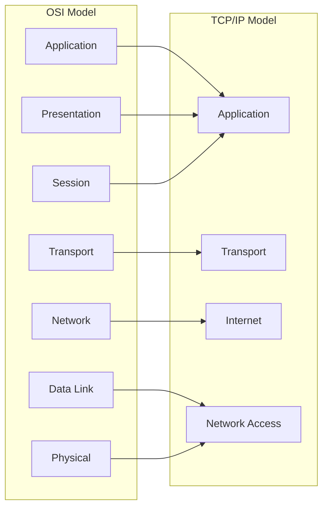
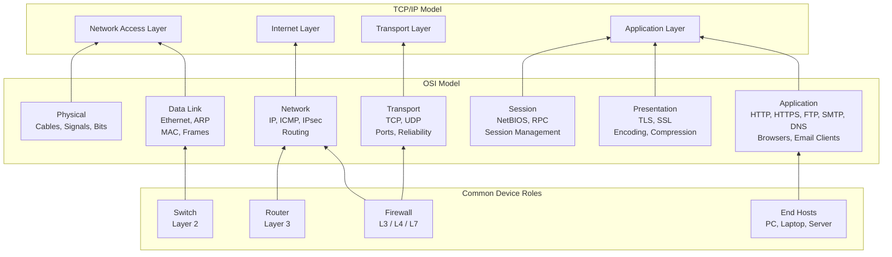
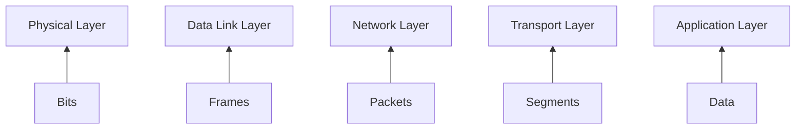

# TCP/IP Model

This section explains the TCP/IP model as used by operating systems.

Focus areas:
- Application layer and services
- Transport layer responsibilities
- Network layer addressing and routing
- Link layer and local delivery

# TCP/IP Model

## 1. What problem do networking models solve?
Networking models exist to structure thinking about complex communication systems.
They provide a shared language that allows engineers to design, implement,
and troubleshoot networks without guessing or reinventing concepts.

## 2. Why multiple models exist
Different models exist because they serve different purposes:

- **OSI Model** focuses on learning, abstraction, and troubleshooting.
  It helps engineers reason about problems by separating concerns.
- **TCP/IP Model** reflects how operating systems and networks actually
  implement communication in real-world systems.

These models are complementary, not competing.

## 3. OSI vs TCP/IP mapping

## 4. How engineers actually use models
Engineers use networking models as mental frameworks:

- During troubleshooting, to isolate problems layer by layer.
- During communication, to describe issues clearly with other engineers.
- During system design, to separate responsibilities and avoid tight coupling.

## 5. Why this matters in real work
Understanding networking models reduces random trial-and-error debugging.
It allows engineers to approach problems systematically, communicate efficiently,
and design systems that scale and remain maintainable.

> Layers are shown bottom-up to reflect how data is physically transmitted
> before being encapsulated and processed at higher levels.

## OSI Layers Explained (Bottom → Top)

### 1. Physical Layer (Layer 1)
**Purpose:**  
Transfers raw bits over a physical medium.

**What actually happens:**  
Electrical, optical, or radio signals represent binary data (0s and 1s).  
This layer does not understand frames, IP addresses, or ports.

**Examples:**  
- Ethernet cables  
- Fiber optics  
- Wi-Fi radio signals  

**Devices:**  
- Cables  
- Network Interface Cards (physical interface)  
- Repeaters  

**Typical issues:**  
- Disconnected or damaged cable  
- No link light  
- Hardware failure  

**Troubleshooting question:**  
> Is there a physical signal?

---

### 2. Data Link Layer (Layer 2)
**Purpose:**  
Delivers data within the same local network.

**What actually happens:**  
Bits are grouped into frames and delivered using MAC addresses.

**Protocols:**  
- Ethernet  
- ARP  
- Wi-Fi (802.11)

**Devices:**  
- Switches  
- Network Interface Cards  

**Typical issues:**  
- ARP failures  
- MAC address conflicts  
- Switch misconfiguration  

**Troubleshooting question:**  
> Can devices see each other on the local network?

---

### 3. Network Layer (Layer 3)
**Purpose:**  
Routes data between different networks.

**What actually happens:**  
Logical addressing (IP) and routing decisions determine the path packets take.

**Protocols:**  
- IP  
- ICMP  
- IPsec  

**Devices:**  
- Routers  
- Firewalls (packet filtering)  

**Typical issues:**  
- Incorrect IP address  
- Wrong default gateway  
- Routing problems  

**Troubleshooting question:**  
> Can I reach the destination network?

---

### 4. Transport Layer (Layer 4)
**Purpose:**  
Provides end-to-end communication between applications.

**What actually happens:**  
Manages ports, reliability, ordering, and flow control.

**Protocols:**  
- TCP (reliable, connection-oriented)  
- UDP (fast, connectionless)

**Examples:**  
- TCP 80 / 443 (HTTP / HTTPS)  
- UDP 53 (DNS)

**Typical issues:**  
- Blocked ports  
- Firewall rules  
- Connection timeouts  

**Troubleshooting question:**  
> Is the service reachable on the correct port?

---

### 5. Session Layer (Layer 5)
**Purpose:**  
Manages sessions between communicating systems.

**What actually happens:**  
Establishes, maintains, and terminates logical sessions.

**Examples:**  
- NetBIOS sessions  
- RPC sessions  

**Reality:**  
Often merged into the Application or Transport layer in modern systems.

**Troubleshooting question:**  
> Is the session being established and maintained correctly?

---

### 6. Presentation Layer (Layer 6)
**Purpose:**  
Ensures data is in a usable and secure format.

**What actually happens:**  
Handles encryption, decryption, encoding, and compression.

**Technologies:**  
- TLS / SSL  
- Character encoding (UTF-8)  
- Compression algorithms  

**Typical issues:**  
- TLS handshake failures  
- Certificate errors  

**Troubleshooting question:**  
> Can the data be securely interpreted?

---

### 7. Application Layer (Layer 7)
**Purpose:**  
Provides network services directly to users and applications.

**What actually happens:**  
Applications interact with the network using high-level protocols.

**Protocols:**  
- HTTP / HTTPS  
- DNS  
- FTP  
- SMTP  

**Applications:**  
- Web browsers  
- Email clients  
- APIs  

**Typical issues:**  
- Application misconfiguration  
- Service not running  
- Incorrect URL or request  

**Troubleshooting question:**  
> Is the application itself functioning correctly?

##

> Network layers separate concerns.  
> Lower layers ensure connectivity, upper layers ensure usability.

##

> As data moves down the stack, it is encapsulated into different protocol data units (PDUs).
> Each layer adds its own header before transmission.

